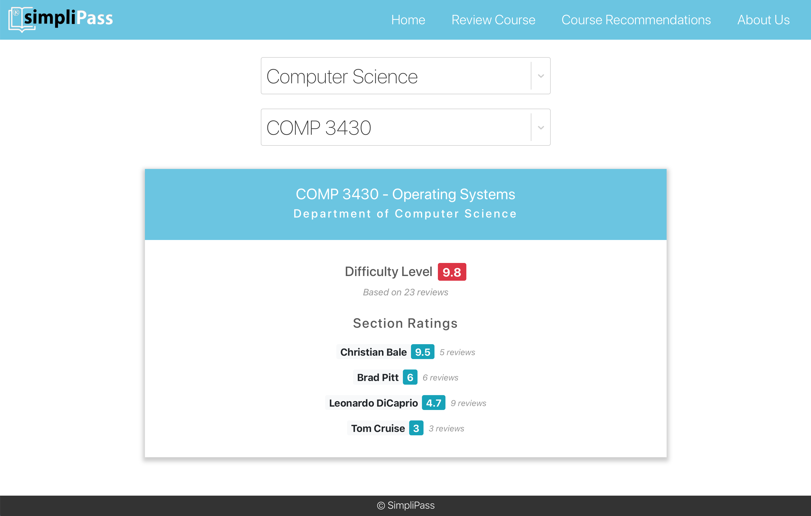
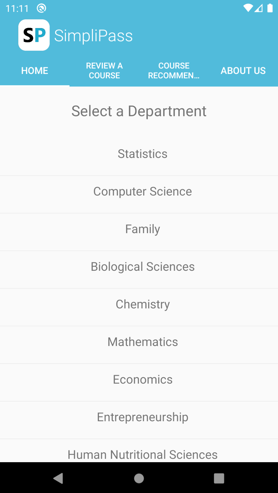
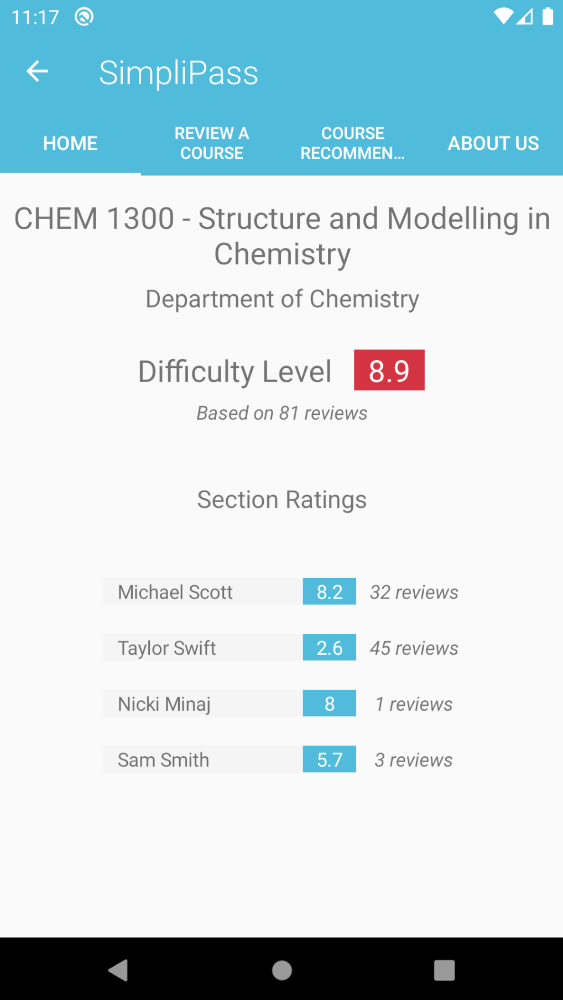
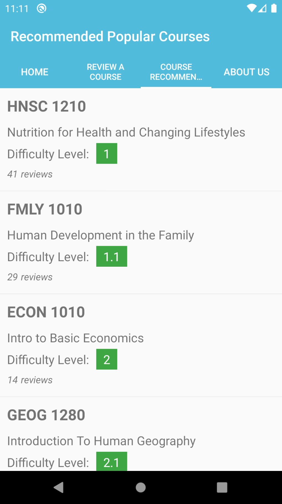

# SimpliPass

_Maximize your academic success through optimal course selections and reviews!_

### What is SimpliPass?

Course selection is one of the most crucial decisions a student must make in their university life. Both course content and instructor are equally important and have a huge impact on a student's overall course experience. Despite this, university students have very little or no insight into what they are signing up for. Sometimes they do not even realize this until later in the course, which ends up in either them withdrawing or receiving an unsatisfactory grade. SimpliPass is a cross-platform mobile and web application that aims to solve this problem by curating section reviews and recommending the best available instructor for a course.

### Web

### Mobile

  

## More Details

- [See Project Wiki](https://github.com/arsh-khokhar/SimpliPass/wiki)
